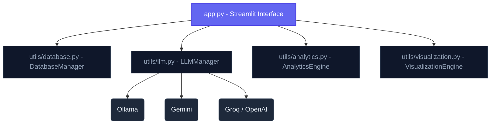

# 📊 Executive AI Business Intelligence Assistant

<p align="center">
  
  
  
  
  
</p>

An elegant, high-performance, and **responsive AI-powered Business Intelligence Assistant** that enables users to upload tabular data (Excel / CSV), query it in natural language, automatically generate interactive charts, run forecasts, and detect anomalies. 

Built on top of Streamlit and SQLite, it automatically translates plain-English queries to SQL and features a self-healing engine to recover from query errors.

---

## 🌟 Key Features

| Feature | Description | Core Engine / Tech |
| :--- | :--- | :--- |
| **Natural Language to SQL** | Ask questions in plain English; get SQL code generated, executed, and explained dynamically. | `sqlite3` + LLM API |
| **Self-Healing SQL** | If the generated SQL fails, the agent auto-corrects the syntax using error tracebacks. | `LLMManager.correct_sql` |
| **Interactive Visualizations** | Automatic layout inference to generate Bar, Line, Scatter, or Pie Plotly charts. | `Plotly` + `VisualizationEngine` |
| **Advanced Forecasting** | Forecast metrics with 80% confidence intervals. Fallbacks cleanly to Exponential Smoothing. | `Prophet` / `statsmodels` |
| **Anomaly Detection** | Automatic outlier tagging for single/multi-feature datasets with dynamic flagging. | `scikit-learn` Isolation Forest |
| **SQL Sandbox** | Direct query execution and interactive schema exploration for advanced technical users. | SQLite System Tables |

---

## 🔮 System Architecture



---

## ⚙️ Supported LLM Providers

Select and configure any of the following providers in the application sidebar:
*   🤖 **Ollama** (Local, free, offline) — e.g. `llama3.2`, `qwen2.5-coder:7b`
*   ♊ **Google Gemini** (Cloud, free developer tier) — e.g. `gemini-2.5-flash`
*   ⚡ **Groq** (Ultra-fast cloud inference) — e.g. `llama-3.3-70b-versatile`
*   🧠 **OpenAI** (Production-grade) — e.g. `gpt-4o-mini`
*   🤗 **Hugging Face** (Serverless inference API)

---

## 🚀 Getting Started

### 📋 Prerequisites
*   **Python 3.9+**
*   Git

### 1. Clone the Repository
```bash
git clone https://github.com/Jayanesh2494/BI-Assistant
cd BI-Assistant
```

### 2. Install Dependencies
```bash
pip install -r requirements.txt
```

### 3. Start the Application
```bash
streamlit run app.py
```

---

## 🛡️ Security & Privacy
*   **Local Database Execution**: All uploaded files are parsed and kept in a secure, isolated, in-memory SQLite database.
*   **Strict Column Sanitization**: Database schemas are sanitized to remove special characters and spaces, preventing SQL injection vulnerabilities and syntax errors.
*   **Minimal Metadata Exposure**: Only database schema information (column names, types, and safe sample ranges) is sent to external LLM providers—never raw rows or sensitive database transactions.

---

## 📁 Repository Layout

*   `app.py`: Entrypoint dashboard containing UI components, sidebar, and layout styling.
*   `requirements.txt`: Project package dependencies list.
*   `utils/`
    *   [database.py]: Sanitization routines and SQLite connection handlers.
    *   [llm.py]: Client integrations for multiple LLM providers.
    *   [analytics.py]: Prophet, statsmodels, and Isolation Forest integrations.
    *   [visualization.py]: Plotly logic and dynamic chart spec builders.
